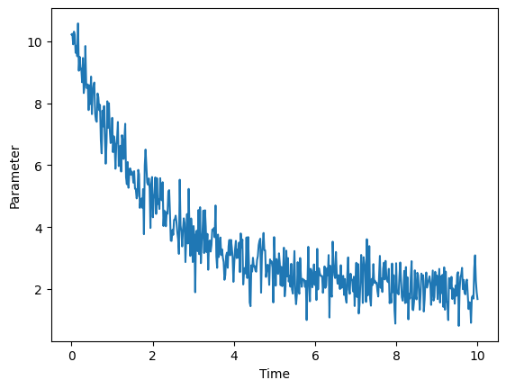

# Initialization and Neighbor Searching 

## System Initialization

In order to perform any molecular dynamics simulations, it is necessary to have some sort of a starting point, from which the simulation parameters can take the model forward in time. However, identifying this starting point is not necessarily an easy task, and can often take some work.

### Solid Lattices

Within a Crystalline Lattice, the locations of all atoms follow a periodic ordering. Specifically, all lattices are composed of unit cells, which are the smallest periodic units which can be repeated throughout all of space (in 2 or 3 dimensions) in order to create the full lattice. These unit are defined by primitive lattice vectors, often denoted $\vec{a_1}$, $\vec{a_2}$, and $\vec{a_3}$, whose linear combinations can be used to identify the location of any unit cell within the lattice.

$$
\vec{R} = n_1 \vec{a_1} + n_2 \vec{a_2} + n_3 \vec{a_3}, \quad n_1, n_2, n_3 \in \mathbb{Z}
$$

Once the structure of a lattice is defined, atoms can be added to each unit cell in order to create the overall crystal. The locations of each atom, often denoted $\vec{r_i}$, is defined relative to the location of the cell, $\vec{R}$, and is the same for the same corresponding atom in each unit cell. Relative to some defined origin of the overall system, the location of every atom is $\vec{R} + \vec{r_i}$. In 3 dimensions, there are a total of 14 different lattice types, and can be divided into the following groups: triclinic, monoclinic, orthorhombic, tetragonal, cubic, trigonal, and hexagonal, based on the relative lengths and angular separations between the primitive lattice vectors. This ordered structure makes it very straightforward to create a solid lattice computationally. Namely, if the cell structure is known, one can very easily repeat that througout space, populating every location of interest with the appropriate atom. 

### Liquids and Gases

While ordered solids can be initialized in a straightforward manner due to their periodic structures, the same cannot be said for liquids and gases. While ideal gases, where there are no inter-atomic forces, can be initialized simply by populating a box with particles that have random locations, things get more complicated when those particles interact with each other. This is primarily because the presence of particle-particle interactions, such as Lennard-Jones potentials, often means that randomly set up configurations can be physically unrealistic, due to factors such as the potentials of the system making the overall energy too large. In cases like this, initialization often still starts by randomly populating a region with particles with velocities drawn from a Boltzmann distribution set at some temperature, but additional steps are necessary to turn this system into something that is more realistic.

Specifically, it is necessary to ensure that the primary quantities describing the system, which are often pressure, volume, temperature, and total energy, are appropriately set up. If one were interested in doing a production run for an ensemble, it is usually necessary to first run a shorter equillibration process with at least one other ensemble that optimizes variables that the production run does not fix. For example, if the desired simulation is to describe an NVE ensemble, it is necessary to first start with an NVT ensemble simulation beforehand, so that the temperature can be brought to a reasonable value in preparation for the primary simulation. This situation is the case for virtually all models of liquids and gases, and the specific pre-simulation procedures that need to be done in order to ensure a system is properly equilibrated can vary depending on the situation. Typically, the equilibration process for a paramter, such as pressure, volume, or energy, as a function of time somewhat resembles the graph shown below.

## Neighbor Searching

Once a production run is in progress, neighbor searching is necessary in order to calculate the total force acting on each particle which, in turn, is needed to determine how that particle will move in the next time step. However, due to the large number of particles in various systems of interest, this process is often time-consuming, and can often lead to simulations taking a long time.

### Verlet Table

Probably one of the most straightforward methods of neighbor searching is to maintain a Verlet table. In essence, a Verlet table is a data structure that stores lists of each atoms neighbors within some cutoff radius, $r_{cut}$, as well as the atoms whose distance to the target atom is between $r_{cut}$ and a larger radius, $r_{cut} + r_{skin}$. Only neighbors within $r_{cut}$ of the target atom are assumed to interact with the target atom through some defined potential. Meanwhile, the presence of the secondary group is to ensure that at each step, only atoms in this second group need to be checked to see if any have entered into the inner radius, $r_{cut}$, and thus now would need to be included in the first neighbor list. In general, this method of keeping track of neighbors scales as $O(N^2)$, increasing quadratically with the number of atoms in the system.

### Cell Linked List

Meanwhile, another method for keeping track of particle neighbors is using a cell linked list. This method first subdivides the system using a grid, where each grid cell is usually larger than the spherical region defined by $r_{cut}$, as defined for the Verlet table. Next, for a target atom and its corresponding target cell, an adjacent cell is considered to be a neighbor if that adjacent cell contains an atom that is within a distance of $r_{cut}$ from the target atom. Thus, for potential energy and force calculations at each step for each atom, this method also reduces the search space from all atoms in the entire system, to only the atoms within the target atom's cell, and atoms in cells that neighbor the target atom's cell. 

## Additional Resources
